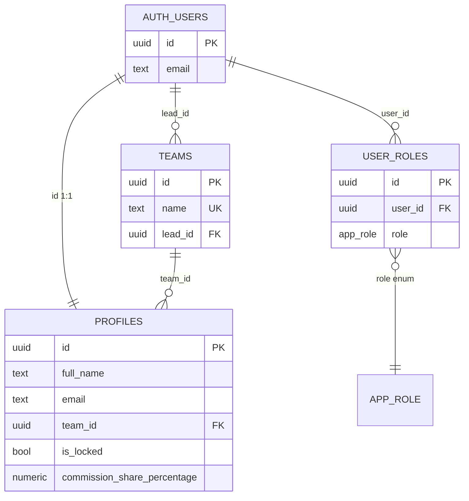
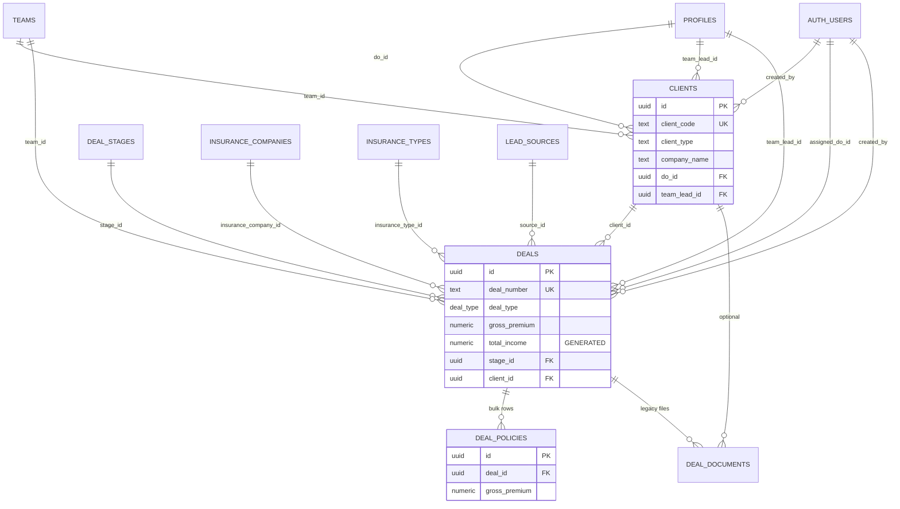
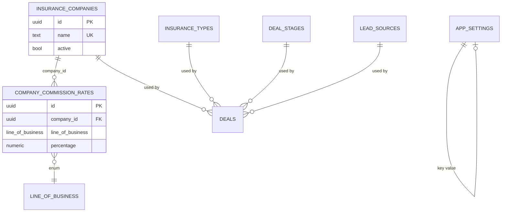
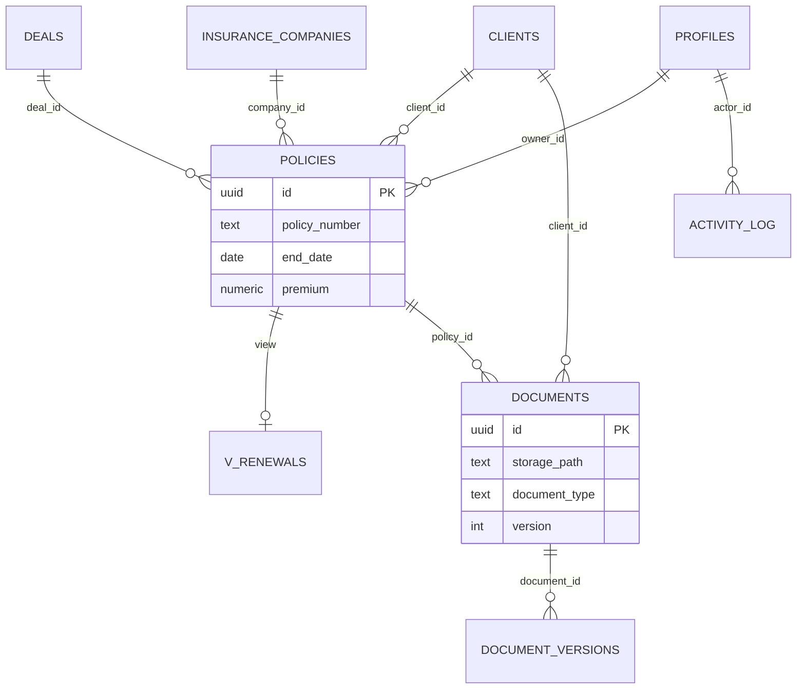
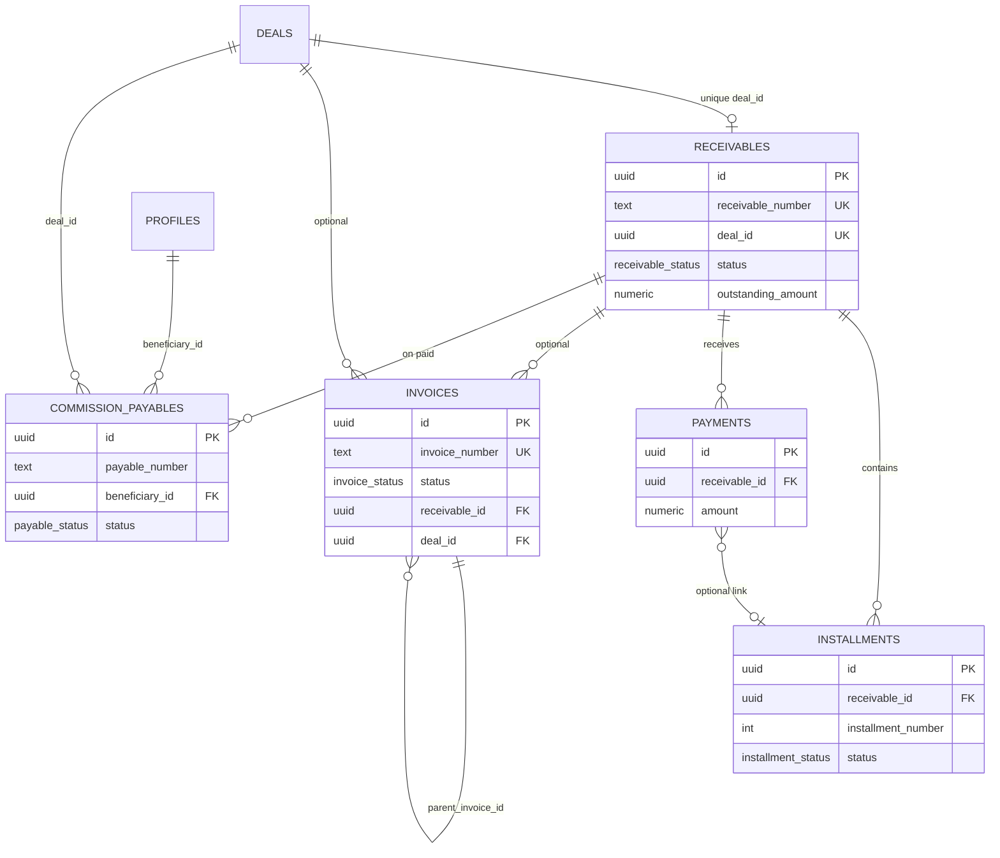
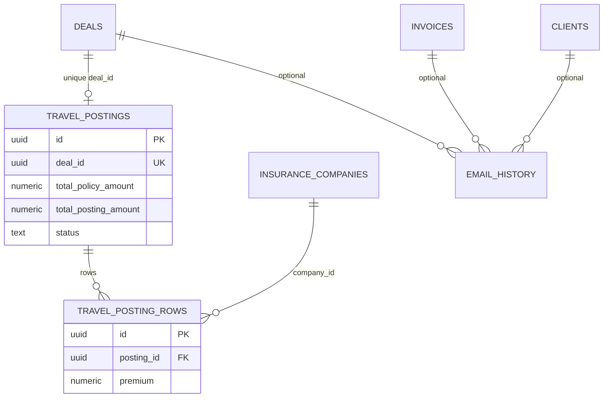
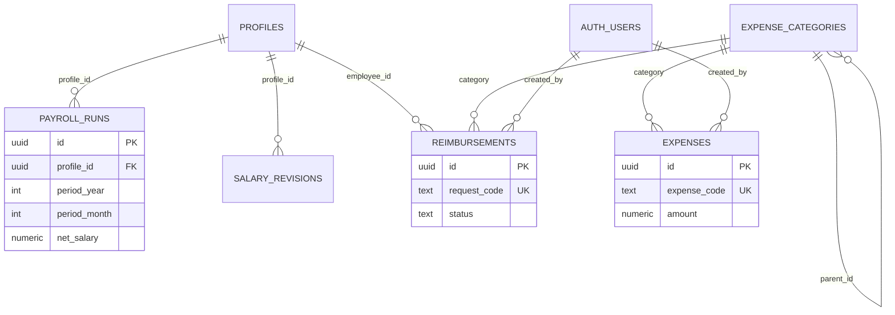
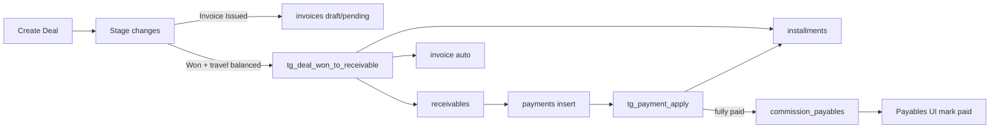

# Database Relationships — InsureBroker CRM

Relationship catalog and ER diagrams from migrations.  
**No schema or application code was modified.**

Legend:

| Notation | Meaning |
| --- | --- |
| **1—1** | One-to-one |
| **1—N** | One-to-many |
| **N—M** | Many-to-many (via junction) |
| **0..1** | Optional |
| **CASCADE / SET NULL / RESTRICT** | ON DELETE behavior |

---

## 1. Relationship inventory

### Identity & organization

| From | To | Cardinality | FK / notes | ON DELETE |
| --- | --- | --- | --- | --- |
| `profiles` | `auth.users` | **1—1** | `profiles.id` | CASCADE |
| `profiles` | `teams` | N—0..1 | `profiles.team_id` | SET NULL |
| `teams` | `auth.users` | N—0..1 | `teams.lead_id` | SET NULL |
| `user_roles` | `auth.users` | N—1 | junction for roles | CASCADE |
| `user_roles` | role enum | N—1 | `role` (`app_role`) | — |

Roles are **N—M** between users and role values via `user_roles` (UNIQUE user_id+role).

### Sales CRM

| From | To | Cardinality | FK | ON DELETE |
| --- | --- | --- | --- | --- |
| `clients` | `auth.users` | N—1 | `created_by` | **RESTRICT** |
| `clients` | `teams` | N—0..1 | `team_id` | SET NULL |
| `clients` | `profiles` | N—0..1 | `do_id`, `team_lead_id` | SET NULL |
| `deals` | `clients` | N—0..1 | `client_id` | SET NULL |
| `deals` | `lead_sources` | N—0..1 | `source_id` | SET NULL |
| `deals` | `insurance_companies` | N—0..1 | `insurance_company_id`, `insurance_company_id_payment` | SET NULL / default |
| `deals` | `insurance_types` | N—0..1 | `insurance_type_id` | SET NULL |
| `deals` | `deal_stages` | N—0..1 | `stage_id` | SET NULL |
| `deals` | `auth.users` | N—0..1 / N—1 | `assigned_do_id` / `created_by` | SET NULL / **RESTRICT** |
| `deals` | `teams` | N—0..1 | `team_id` | SET NULL |
| `deals` | `profiles` | N—0..1 | `team_lead_id`, `received_by` | SET NULL |
| `deal_policies` | `deals` | N—1 | `deal_id` | CASCADE |
| `deal_documents` | `deals` / `clients` | N—0..1 | optional parents | CASCADE |
| `user_targets` | `profiles` | N—1 | `user_id` | CASCADE |
| `company_commission_rates` | `insurance_companies` | N—1 | `company_id` | CASCADE |

### Policies & documents

| From | To | Cardinality | FK | ON DELETE |
| --- | --- | --- | --- | --- |
| `policies` | `clients` | N—0..1 | `client_id` | CASCADE |
| `policies` | `deals` | N—0..1 | `deal_id` | SET NULL |
| `policies` | `insurance_companies` | N—0..1 | `company_id` | SET NULL |
| `policies` | `profiles` / `teams` | N—0..1 | owner/team | SET NULL |
| `documents` | `clients` / `policies` / `companies` | N—0..1 | optional | SET NULL |
| `document_versions` | `documents` | N—1 | `document_id` | CASCADE |
| `activity_log` | `profiles` | N—0..1 | `actor_id` | SET NULL |

### Accounts

| From | To | Cardinality | FK | ON DELETE |
| --- | --- | --- | --- | --- |
| `receivables` | `deals` | **1—0..1** (unique `deal_id`) | `deal_id` | **RESTRICT** |
| `receivables` | `clients` / `teams` / DO / TL | N—0..1 | ownership | SET NULL |
| `invoices` | `receivables` | N—0..1 | `receivable_id` | CASCADE |
| `invoices` | `deals` | N—0..1 | `deal_id` | CASCADE |
| `invoices` | `invoices` | N—0..1 parent | `parent_invoice_id` | CASCADE |
| `installments` | `receivables` | N—1 | | CASCADE |
| `payments` | `receivables` | N—1 | | **RESTRICT** |
| `payments` | `installments` | N—0..1 | | SET NULL |
| `commission_payables` | `receivables` / `deals` | N—1 | | CASCADE |
| `commission_payables` | `profiles` | N—1 | `beneficiary_id` | **RESTRICT** |

### Travel & email

| From | To | Cardinality | FK | ON DELETE |
| --- | --- | --- | --- | --- |
| `travel_postings` | `deals` | **1—0..1** (unique) | `deal_id` | CASCADE |
| `travel_posting_rows` | `travel_postings` | N—1 | | CASCADE |
| `travel_posting_rows` | `insurance_companies` | N—0..1 | `company_id` | — |
| `email_history` | deals / invoices / clients | N—0..1 | | SET NULL |

### Ops / HR

| From | To | Cardinality | FK | ON DELETE |
| --- | --- | --- | --- | --- |
| `payroll_runs` | `profiles` | N—1 | | CASCADE |
| `salary_revisions` | `profiles` | N—1 | | CASCADE |
| `expense_categories` | `expense_categories` | tree | `parent_id` | CASCADE |
| `expenses` | `expense_categories` | N—0..1 | cat/subcat | — |
| `expenses` | `auth.users` | N—1 | `created_by` | — |
| `reimbursements` | `profiles` | N—1 | `employee_id` | CASCADE |
| `reimbursements` | `expense_categories` | N—0..1 | | — |

### Junction / M:N summary

| Pattern | Implementation |
| --- | --- |
| User ↔ Role | `user_roles` |
| Company ↔ LOB rates | `company_commission_rates` (not pure M:N of entities—rate matrix) |
| No classic M:N clients↔companies | Relationship is via `deals` / `policies` |

---

## 2. Ownership & multi-tenant model

Not multi-org SaaS. Scoping model:

```
Organization (implicit single tenant)
  └── teams
        └── profiles (DOs, Team Leads)
              └── ownership snapshots on clients / deals
                    (do_id, team_lead_id, team_id, assigned_do_id, created_by)
```

RLS uses snapshots + `has_role` + `current_user_team()` so historical rows remain visible to the TL/DO captured at write time.

---

## 3. Soft delete & cascades

- **Soft delete:** none (`deleted_at` absent).  
- **RESTRICT:** protects finance integrity (`clients.created_by`, `deals.created_by`, `receivables.deal_id`, `payments.receivable_id`, payable beneficiaries).  
- **CASCADE:** cleans children (installments, deal_policies, travel rows, document versions, payroll rows).  
- **SET NULL:** optional FKs when parent removed (many deal/client optional refs).

---

## 4. ER diagrams (Mermaid)

### 4.1 Identity & org



### 4.2 Core CRM (clients & deals)



### 4.3 Master data & rates



### 4.4 Policies & documents



### 4.5 Accounts (receivables → money)



### 4.6 Travel specialty



### 4.7 Ops / HR



### 4.8 End-to-end deal money flow



---

## 5. Application flow examples

### Create client → create deal

```
UI /clients insert → clients (RLS: created_by = uid)
  → tg_clients_autofill sets team_id / do_id / team_lead_id
  → tg_clients_set_code sets client_code

UI /deals/new insert → deals (+ optional deal_policies)
  → tg_deals_autofill sets ownership + net_premium
  → generated columns compute commission/income
```

### Win a deal → collect money

```
UI updates deals.stage_id → won stage
  → tg_deal_travel_posting_guard may BLOCK (Travel)
  → tg_deal_won_to_receivable creates receivables + installments + invoice + audit

UI records payments
  → tg_payment_apply updates installments/receivable
  → on full pay inserts commission_payables for DO/TL shares
```

### Admin creates user

```
UI /users → createServerFn createUser
  → requireSupabaseAuth + has_role(admin)
  → supabaseAdmin.auth.admin.createUser
  → handle_new_user creates profiles + default do role
  → admin updates profiles / user_roles via service role
```

---

## 6. Orphan / weak relationship notes

1. **`deal_documents` vs `documents`** — parallel models; app uses Storage paths on expenses/reimbursements instead.  
2. **`policies` vs `deals.policy_*`** — renewals combine both; not always synchronized by trigger.  
3. **Invoice dual parents** — may link receivable, deal, both, or (with later migration) neither for manual docs.  
4. **Travel/deal_policies RLS** — existence checks ≠ ownership checks.  
5. **`teams.lead_id` → auth.users** while ownership snapshots use `profiles` — same UUID space, two FK targets conceptually.

---

*See [`DATABASE_OVERVIEW.md`](./DATABASE_OVERVIEW.md) and [`DATABASE_SCHEMA.md`](./DATABASE_SCHEMA.md).*
